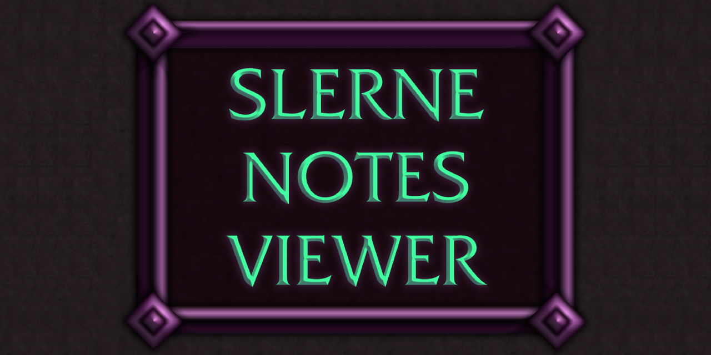

# Slerne Notes Viewer

  

Read-only companion to Slerne Notes. It receives raid assignment canvases
broadcast from Slerne Notes and lets you flip through the pages. You do not need
Slerne Notes installed to use it.

Parts of this addon were developed with AI assistance.

## Installation

Copy the `SlerneNotesViewer` folder into
`World of Warcraft/_retail_/Interface/AddOns/`, then enable it on the character
select addon list.

## Usage

Open the window with `/snv` or the minimap button. When someone running Slerne
Notes broadcasts a canvas to your group, it appears here automatically with your
own name highlighted.

- Draw on the plan with the pencil. Your strokes are private, saved per page, and never sent to anyone.
- Press **E** on any module to pop it out as a movable, resizable window you can keep on screen mid-fight.
- Press **C** on a Text Block to open its text ready to copy with Ctrl+C.
- Click an animated Flipbook module to pause or resume it.
- Archive canvases you are done with. They move into an Archive folder in the canvas dropdown.

## Custom art

`img/maps/custom/` and `img/flipbooks/custom/` are yours to fill, and both are
ignored by git. To see a custom map or flipbook that your raid leader used, drop
the same file into the matching folder.

## License

Source code is released under the MIT License. See [LICENSE](LICENSE).

The MIT License covers the code only. It does not cover the image assets:

- World of Warcraft icons and map textures are property of Blizzard Entertainment. They are used in line with Blizzard's addon policy. This addon is free and non-commercial.
- Custom art in `img/` was commissioned from Tado and Taco and remains their property. It is included here with permission and is not licensed for reuse.

## Credits

- Custom art by Tado: https://instagram.com/tadogram
- Secret easter egg art by Taco
- Bundled libraries: LibStub, CallbackHandler-1.0, LibDataBroker-1.1, and LibDBIcon-1.0, each under its own license.
